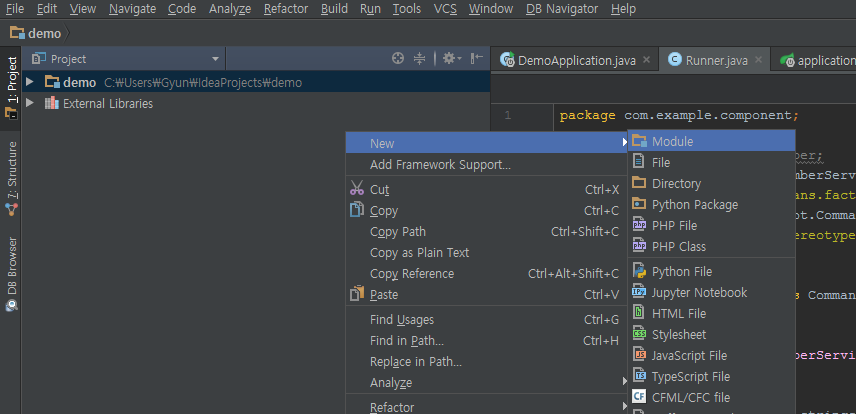

# Spring Data JPA 환경 구축(Console)

## 1. Spring boot(InteliJ 기준 작성)
- Spring data jpa를 사용하기 위해서는 Spring 환경을 구축해야 합니다. 
- 편하게 구축하기 위해 Spring Boot를 사용합니다.
  `Project 창 우클릭 > NEW > Module을 선택`
  `Spring Initalize 선택 후 Next 선택`
  `Maven 설정`
  `사용할 Module 선택 (현재 JPA를 사용한 Console Program을 작성이라 SQL>JPA 만 선택)`
  `저장할 모듈명을 작성 후 FINISH 버튼을 누릅니다.`

## 2. Derby  설정

- 현재 로컬에 구축 후 테스트를 해보기 위해 Derby Database를 사용하였습니다.

  [Derby Database란?]: http://babytiger.tistory.com/entry/JAVA-derby-database

- pom.xml에 dependency 추가

  ```xml
  <dependency>
  	<groupId>org.apache.derby</groupId>   
  	<artifactId>derby</artifactId>
  	<version>10.12.1.1</version>
  </dependency>
  ```

- src/main/resources/application.properties 추가

  ```properties
  #DDL을 Generate할 것인지 여부
  spring.jpa.hibernate.ddl-auto=create
  #DDL을 Generate할 것인지 여부
  spring.jpa.generate-ddl=false
  #SQL을 CONSOLE에 출력 할 것인지 여부
  spring.jpa.show-sql=true

  #Derby JDBC URL(파일 생성될 위치는 project경로의 target/ 하위 입니다.)
  spring.datasource.url=jdbc:derby:target/database/message;create=true
  spring.datasource.username=root
  spring.datasource.password=1234
  # 사용할 JDBC Driver
  spring.datasource.driverClassName=org.apache.derby.jdbc.EmbeddedDriver
  ```

## 3. 프로젝트 Test Source 작성

*  기동이 정상적으로 되는지 확인을 위해 Sample 소스를 작성합니다.

*  패키지 구조
      com.example.component
      com.example.dao
      com.example.entity
      com.example.service
      
   `Package 구조`

*  com.example.service.MemberService작성

   ```java
    package com.example.service;

    import com.example.dao.MemberDao;
    import com.example.entity.Member;
    import org.springframework.beans.factory.annotation.Autowired;
    import org.springframework.stereotype.Service;

    import java.util.List;

    @Service
    public class MemberService {
    	@Autowired
    	private MemberDao memberDao;

    	public Member putMember(Member member){
            //jpa method를 통한 Member Save
    		return memberDao.save(member);
    	}
    	public List<Member> getMembers(){
            //Member table 전체를 select하여 db조회
    			return memberDao.findAll();
    	}
    }

   ```

*  com.example.component.Runner 작성
      (CommandLineRunner를 상속받아 CommandLine Application용 Component)

   ```java
      package com.example.component;

      import com.example.entity.Member;
      import com.example.service.MemberService;
      import org.springframework.beans.factory.annotation.Autowired;
      import org.springframework.boot.CommandLineRunner;
      import org.springframework.stereotype.Component;

      @Component
      public class Runner implements CommandLineRunner{

      	@Autowired
      	private MemberService memberService;

      	@Override
      	public void run(String... strings) throws Exception {
      		Member member = new Member();
      		member.setName("User Name Test");
            //새로운 Member를 DB에 추가
      		memberService.putMember(member);
            // 추가된 Member를 select를 통하여 출력
      		System.out.println(memberService.getMembers());
      	}
      }
   ```

*  com.example.dao.MemberDao.java

   ```java
      package com.example.dao;

      import com.example.entity.Member;
      import org.springframework.data.jpa.repository.JpaRepository;
      import org.springframework.stereotype.Repository;

      @Repository
      public interface MemberDao extends JpaRepository<Member,Long>{

      }
   ```

*  com.example.entity.Member

   ```java
      package com.example.entity;

      import javax.persistence.*;

      /**
   * The type Member.
   */
   @Entity
   public class Member {
   	/**
   	 * The Id.
   	 */
   	@Id
   	@GeneratedValue(strategy = GenerationType.AUTO)
   	private long id;
   	/**
   	 * The Name.
   	 */
   	@Column(length = 20,nullable = false)
   	private String name;

   	/**
   	 * Gets id.
   	 *
   	 * @return the id
   	 */
   	public long getId() {
   		return id;
   	}

   	/**
   	 * Sets id.
   	 *
   	 * @param id the id
   	 */
   	public void setId(long id) {
   		this.id = id;
   	}

   	/**
   	 * Gets name.
   	 *
   	 * @return the name
   	 */
   	public String getName() {
   		return name;
   	}

   	/**
   	 * Sets name.
   	 *
   	 * @param name the name
   	 */
   	public void setName(String name) {
   		this.name = name;
   	}

   	@Override
   	public String toString() {
   		final StringBuilder sb = new StringBuilder("Member{");
   		sb.append("id=").append(id);
   		sb.append(", name='").append(name).append('\'');
   		sb.append(", Super='").append(super.toString());
   		sb.append('}');
   		return sb.toString();
   	}

   	@Override
   	public boolean equals(Object o) {
   		if (this == o) return true;
   		if (o == null || getClass() != o.getClass()) return false;

   		Member member = (Member) o;

   		if (id != member.id) return false;
   		return name.equals(member.name);

   	}

   	@Override
   	public int hashCode() {
   		int result = (int) (id ^ (id >>> 32));
   		result = 31 * result + name.hashCode();
   		return result;
   	}
   }
   ```

## 4. Application 실행  

- DemoApplication.java를 실행하면 아래의 이미지와 같이 출력되면 정상적으로 실행이 된것입니다.

`Console 출력 결과`